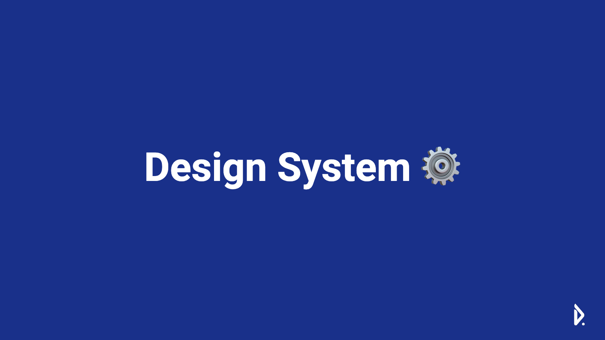

# devent-designsystem-prototype
디자인 시스템 프로토타입

## To-Do

**feat(js)**

* [x] navbar
* [x] header
* [x] modal
* [ ] alert
* [ ] footer

* [x] sidebar
* [ ] tab


**feat(scss)**

* [x] button
* [ ] color set (blue, red, green, yellow)


**module**

* [x] webpack 번들 파일 생성
* [x] scss 적용

**docs**

* [x] index 페이지 문서 생성
* [ ] 디자인 가이드/철학/목표 명시


## 목표

데벤트가 배포하는 서비스마다 디자인의 통일감을 준다.  
같은 코드의 반복을 낮춰 효율적인 개발을 가능하게 한다.  
최종적으로 CDN 서버에 배포하며 하나의 디자인만 변경해도 동시에 적용되게끔 한다.  

## 실행

**서버 실행**

```
npm run start
```

**번들링(개발)**

```
npm run bundle:development
```

**번들링(프로뎍션)**

```
npm run bundle:production
```


## 기술

**FE**

Web Components  
Bootstrap 5 (add shard ui)  
Webpack  


**BE**

Node v17.5  
Express  
